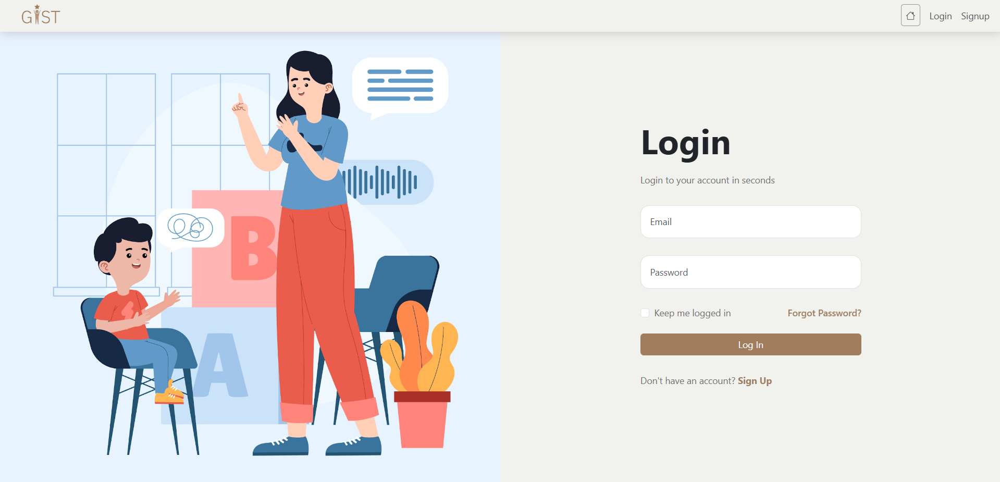
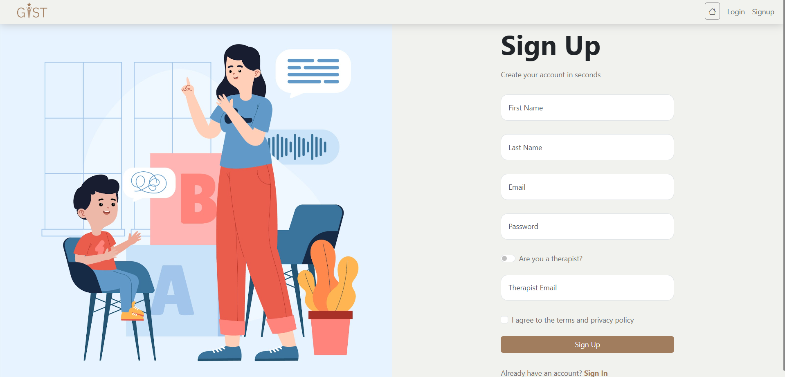
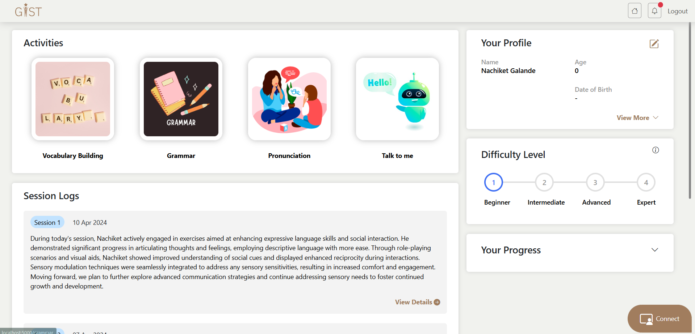
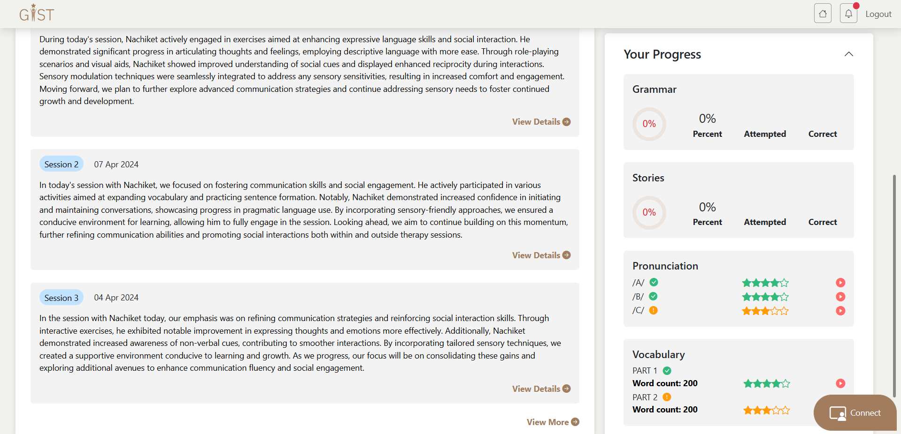
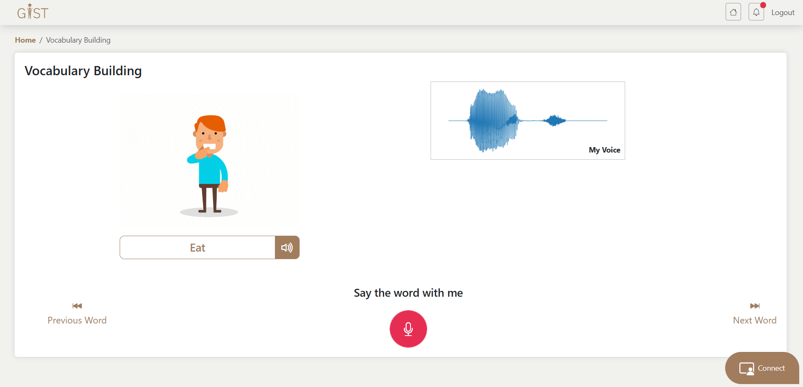
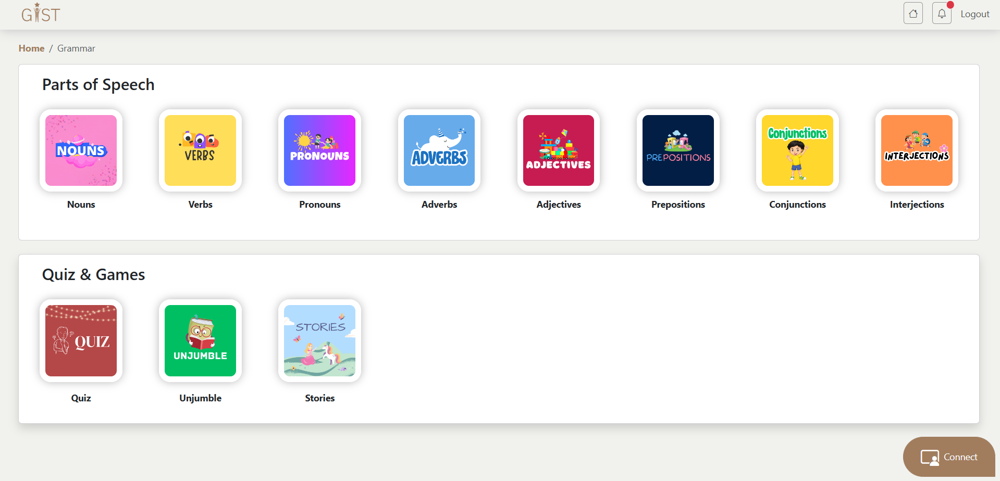

# GIST (Generative Intelligence Speech Therapy)

## Overview
GIST aims to support children with autism by providing a comprehensive platform with multiple interactive modules designed to enhance learning and communication. The platform leverages generative AI to offer personalized learning experiences and real-time therapist interaction.

## Features
- **Vocabulary Building Module:** Uses generative AI to create dynamic vocabulary exercises.
- **Grammar Module:** Incorporates generative AI to provide customized grammar lessons and games.
- **Pronunciation Module:** Utilizes generative AI for personalized pronunciation practice.
- **Talk to Me Module:** Engages users in interactive conversations powered by generative AI.
- **Profile Section:** Allows user to track their progress realtime.
- **Therapist Review Module:** Tracks and analyzes user progress, enabling personalized therapy sessions.
- **Video Call Integration:** Allows real-time communication between users and therapists.

## Technology Stack

### Frontend
- **HTML:** Structure and content of the web pages.
- **CSS:** Styling and layout of the platform.
- **Vanilla JavaScript:** Interactive elements and dynamic content.
- **Bootstrap:** Responsive design and components for an engaging UI.

### Backend
- **Python Flask:** Backend framework for handling requests and managing the application.
- **SQLAlchemy:** ORM for managing database interactions and data persistence.

### Generative AI
- **Content Generation:** Generative AI models are used to dynamically create educational content for various modules, ensuring personalized learning experiences.

## Modules

### Vocabulary Building
- **Functionality:** Provides dynamic vocabulary exercises tailored to the user’s learning level.
- **Technology:** Leveraging generative AI to create a diverse range of vocabulary exercises.

### Grammar
- **Functionality:** Customizes grammar lessons based on the user's progress and needs.
- **Technology:** Incorporates generative AI to offer a personalized learning experience.

### Pronunciation
- **Functionality:** Offers pronunciation practice exercises tailored to the user's requirements.
- **Technology:** Uses generative AI to ensure personalized feedback and practice sessions.

### Talk to Me
- **Functionality:** Engages users in interactive conversations to improve their communication skills.
- **Technology:** Powered by generative AI for dynamic and personalized interactions.

### Therapist Review
- **Functionality:** Tracks user progress and analyzes performance to facilitate personalized therapy.
- **Technology:** Data analytics and tracking mechanisms integrated into the platform.

### Video Call Integration
- **Functionality:** Enables real-time video communication between users and therapists.
- **Technology:** Integrated video calling features for seamless interaction.

## Screenshots

### Login Page


### Signup Page


### Login Page


### Profile Page




### Vocabulary Building Page


### Grammar Page


## Getting Started

### Prerequisites
- Python 3.x

### Installation
1. **Clone the repository:**
   ```bash
   git clone https://github.com/nachiketgalande1609/GIST.git
   ```
2. **Navigate to the project directory:**
   ```bash
   cd GIST
   ```
3. **Install backend dependencies:**
   ```bash
   pip install -r requirements.txt
   ```

### Running the Application
1. **Start the Flask server:**
   ```bash
   python app.py
   ```
2. **Open the application in your browser:**
   ```bash
   http://localhost:5000
   ```

## Contributing
We welcome contributions to enhance the platform. Please fork the repository and submit pull requests with your changes.

This documentation provides a comprehensive overview of the Autism Support Platform, including its features, technology stack, and installation instructions. Feel free to customize it further as needed.
